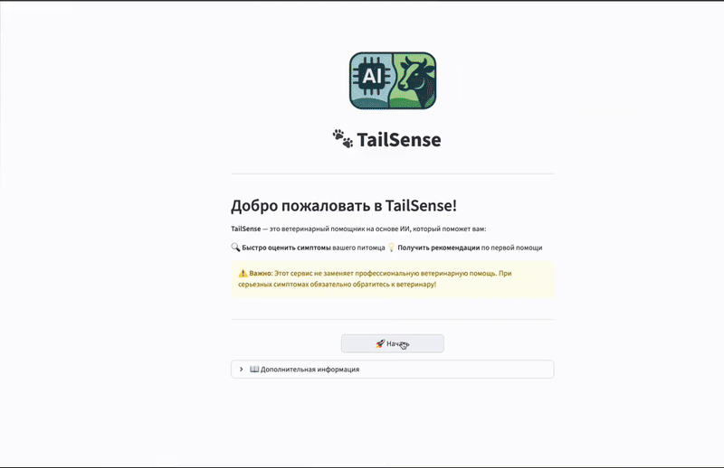

# [Ссылка на MVP AI-ассистента](http://193.233.161.212:8501)

---

# TailSense

**TailSense** — интеллектуальный AI-ассистент для ветеринарных специалистов, фермеров и владельцев, предоставляющий рекомендации по диагностике и лечению заболеваний животных на основе современных технологий искусственного интеллекта и базы ветеринарных знаний.

---

## Описание проекта

TailSense — это MVP (минимально жизнеспособный продукт) AI-помощника для ветеринарной сферы. Проект демонстрирует возможности интеграции искусственного интеллекта в ветеринарную практику, предлагая базовый функционал для получения консультаций по здоровью животных через простой веб-интерфейс.

---

### Демо


*Полная демонстрация функционала TailSense: от создания сессии до получения ветеринарных рекомендаций*

---

## Основные возможности

- ** Обширная база знаний**: Система обучена на специализированной ветеринарной литературе в
- ** Быстрый поиск информации**: Мгновенные ответы на сложные ветеринарные вопросы
- ** Поддержка различных видов**: Консультации по КРС, лошадям, мелким домашним животным и экзотическим видам
- ** Интерактивный чат**: Удобный веб-интерфейс с историей диалогов и сессиями
- ** Конфигуратор симптомов**: Структурированный ввод данных о животном и симптомах

---

##Архитектура системы

TailSense построен по микросервисной архитектуре и состоит из трех основных компонентов:

```
┌─────────────────────────────────────────────────────────────┐
│                    TailSense Ecosystem                      │
├─────────────────────────────────────────────────────────────┤
│   Frontend (Streamlit)        │  Backend (FastAPI)          │
│  Port: 8501                   │  Port: ****                 │
│                               │                             │
│  • Пользовательский интерфейс │  • REST API                 │
│  • Чат с ИИ                   │  • Обработка запросов       │
│  • Конфигуратор животных      │  • Middleware & CORS        │
│  • Управление сессиями        │  • Валидация данных         │
└─────────────────────────────────────────────────────────────┘
                                │
                                ▼
┌────────────────────────────────────────────────────────────┐
│                     AI Agent (LangFlow)                    │
│                       Port: ****                           │
│                                                            │
│  • Обработка ИИ-запросов                                   │
│  • RAG (Retrieval-Augmented Generation)                    │
│  • Интеграция с LLM                                        │
│  • Поиск по базе знаний                                    │
└────────────────────────────────────────────────────────────┘
                                │
                                ▼
┌─────────────────────────────────────────────────────────────┐
│                          База знаний                        │
│                                                             │
│  • Ветеринарные справочники                                 │
│  • Клинические руководства                                  │
│  • Фармакологические данные                                 │
│  • Международные стандарты                                  │
└─────────────────────────────────────────────────────────────┘
```

### Компоненты системы

#### Frontend (Streamlit)
- **Технология**: Python Streamlit
- **Порт**: 8501
- **Функции**:
  - Интерактивный веб-интерфейс
  - Чат с AI-ассистентом
  - Конфигуратор животных и симптомов
  - Управление историей диалогов

#### Backend (FastAPI)
- **Технология**: Python FastAPI
- **Порт**: ____
- **Функции**:
  - REST API для фронтенда и внешних интеграций
  - Проксирование запросов к AI-агенту
  - Валидация и обработка данных

#### AI Agent (LangFlow)
- **Технология**: LangFlow
- **Порт**: 7860
- **Функции**:
  - Обработка запросов к ИИ
  - RAG для поиска в базе знаний
  - Генерация ответов на основе контекста
  - Управление сессиями диалогов

---

## Использование

### 1. Главная страница
Перейдите на http://localhost:8501. Вы увидите экран приветствия с описанием возможностей системы.

### 2.Конфигуратор
- Выберите тип животного из предустановленного списка или введите свой вариант
- Укажите наблюдаемые симптомы с помощью удобного интерфейса
- Добавьте дополнительную информацию при необходимости

### 3. Чат с ИИ-ассистентом
- Задавайте вопросы на естественном языке
- Получайте детальные профессиональные консультации
- История диалога сохраняется в рамках сессии
- Контекст беседы учитывается в последующих ответах

### 4. Примеры запросов

```
 "Какие причины могут вызывать хромоту у коров?"

 "Дозировка амоксициллина для кошки весом 4 кг при инфекции мочевыводящих путей"

 "Дифференциальная диагностика рвоты у собак"

 "Протокол лечения мастита у коров"
```

---

### Структура проекта

```
TailSense/
├── rontend/                 # Streamlit приложение
│   ├── app.py               # Основной файл приложения
│   ├── screens/             # Экраны интерфейса
│   ├── components/          # UI компоненты
│   ├── utils/               # Утилиты и API клиент
│   └── requirements.txt     # Зависимости Python
│
├── backend/                 # FastAPI сервер
│   ├── main.py              # Основной API сервер
│   ├── models.py            # Pydantic модели
│   ├── config.py            # Конфигурация
│   └── requirements.txt     # Зависимости Python
|
|–– docs/
|   |–– image                # Скриншоты
│
├── agent/                   # LangFlow AI агент
│   ├── flows/               # Конфигурация потоков
│   ├── data/                # Данные агента
│   └── docker.env           # Переменные окружения
│
├── data_source/             # База знаний
│   ├── papers/              # Ветеринарная литература
│   └── web/                 # Веб-источники
│
├── notebooks/               # Jupyter ноутбуки
│   ├── RAG.ipynb            # Разработка RAG системы
│   └── benchmark.ipynb      # Тестирование и бенчмарки
│
├── docker-compose.yaml      # Оркестрация сервисов
└── README.md                # Документация проекта
```

---

## Автор

- **Разработчик**: Чернобай Андрей

---

</div>
